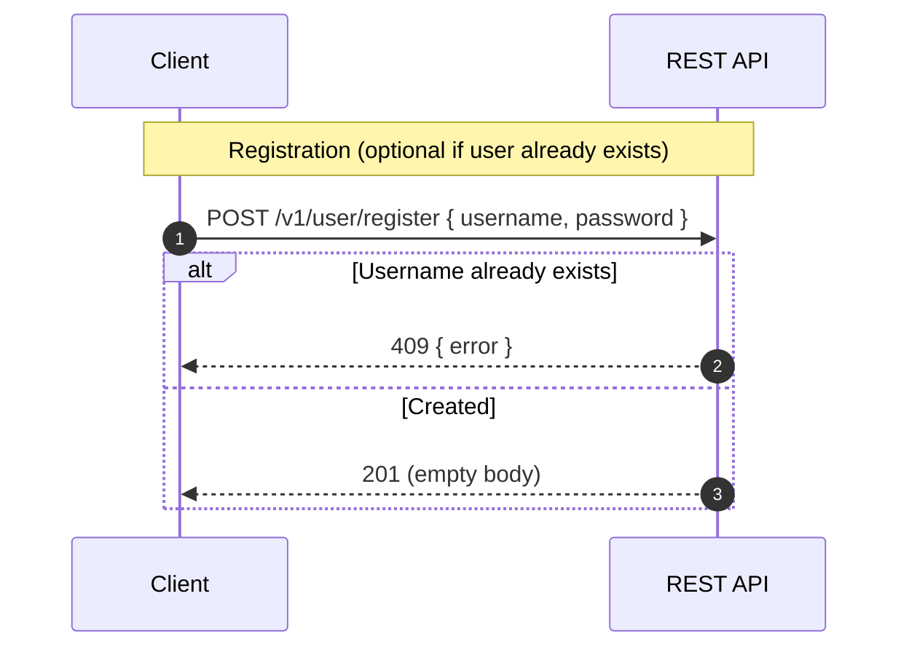
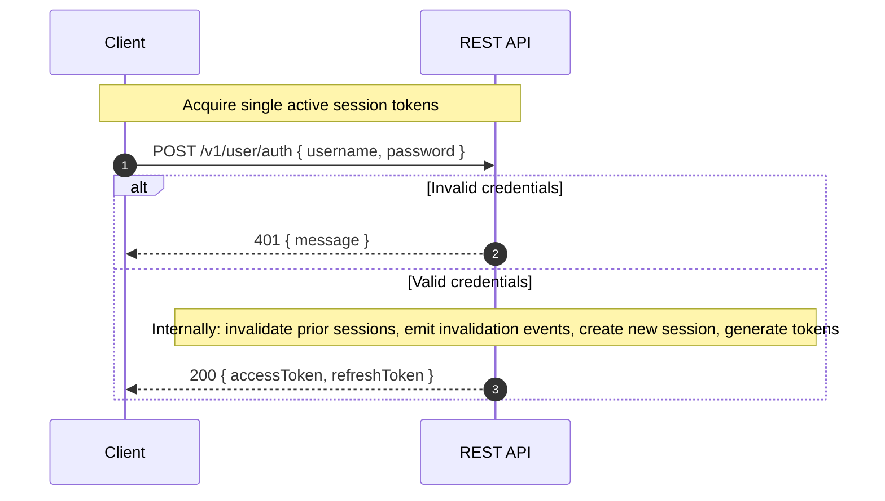
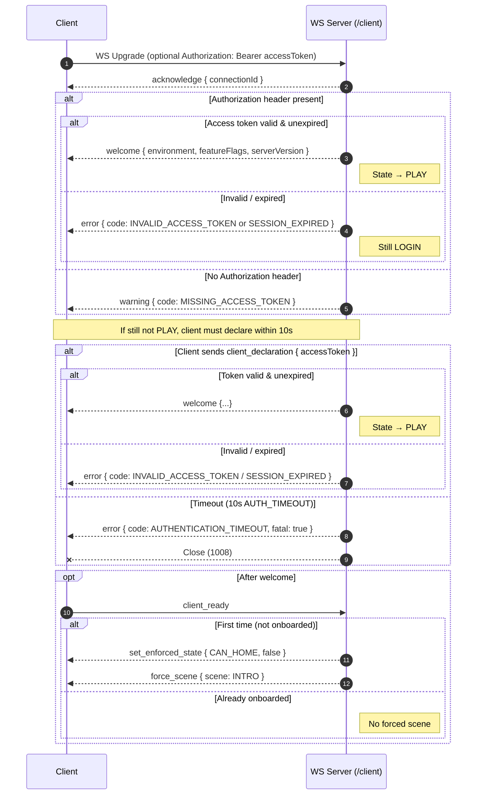
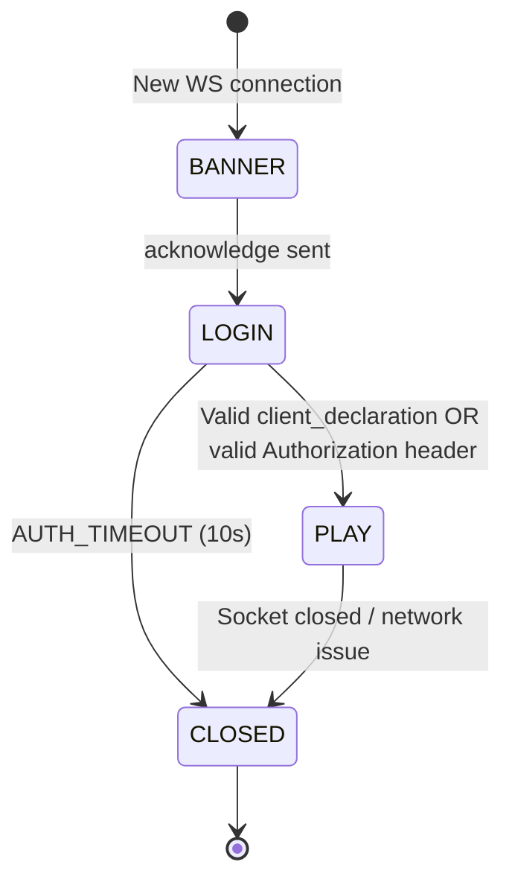
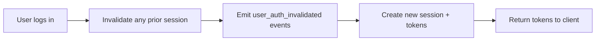
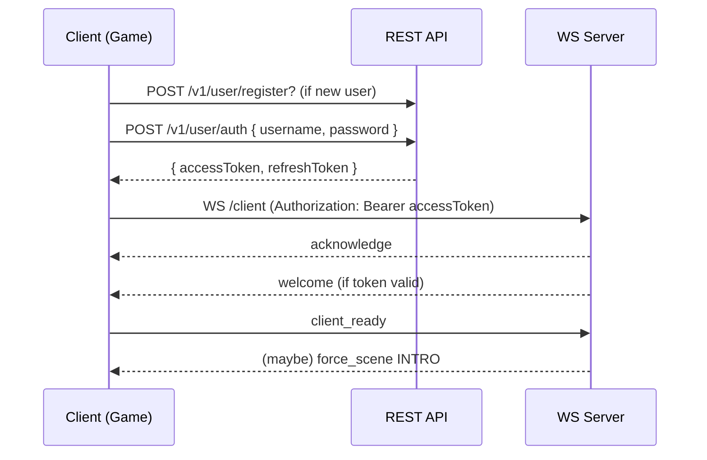

# Authentication Flow

This document describes how authentication works in the Echoform authoritative backend as implemented in this repository. It covers:

- Account registration
- User authentication (login)
- Session + token model (access + refresh)
- WebSocket handshake & in-session auth
- Session invalidation (single-session enforcement)
- Client readiness and onboarding gating
- Timeouts & error conditions
- Extension points (refresh flow not yet implemented)

> Note: A `refreshToken` is issued and stored, but there is currently **no refresh endpoint** in the backend. A future `/v1/user/refresh` route would be the natural extension.

## Entities & Tables

- `users`: id, name (unique), passwordHash, onboarded (nullable boolean)
- `user_sessions`: id, userId (FK → users, cascade delete), accessToken (unique), refreshToken (unique), expiresAt (access token expiry), refreshTokenExpiresAt

## Token & Session Rules

- Access token length: 32 characters (`TOKEN_LENGTH = 32`)
- Access token lifetime: 30 days (code: `addDays(now, 30)`)
- Refresh token lifetime: 90 days (`addDays(now, 90)`)
- Only **one active session per user**. On successful authentication:
  - All existing sessions for that user are deleted
  - A `user_auth_invalidated` pubsub message is emitted once per prior session with `{ sessionId }`
  - A new session is inserted

## REST Endpoints (v1)

Base path: `/v1/user`

- `POST /v1/user/register` → Register new user
- `POST /v1/user/auth` → Authenticate (login) & obtain `{ accessToken, refreshToken }`

## WebSocket Entry Point

- `GET /client` (Upgrades to WebSocket)
  - Optional `Authorization: Bearer <accessToken>` header
  - If provided and valid, server short-circuits to authenticated state (sends `welcome`)
  - Otherwise client must send `client_declaration` packet with `{ accessToken }` within `AUTH_TIMEOUT` (10s) or connection closes with `AUTHENTICATION_TIMEOUT` error.

## Packet Overview (Serverbound → Clientbound)

Serverbound (relevant to auth):
- `client_declaration { accessToken }`
- `client_ready` (signals game scene readiness)

Clientbound (relevant subset):
- `acknowledge { connectionId }`
- `warning` (`MISSING_ACCESS_TOKEN`)
- `error` (e.g. `INVALID_ACCESS_TOKEN`, `SESSION_EXPIRED`, `AUTHENTICATION_TIMEOUT`, `CLIENT_ALREADY_READY`)
- `welcome { serverVersion, environment, featureFlags }`
- `set_enforced_state { name: CAN_HOME, value }`
- `force_scene { scene: INTRO }` (if user not onboarded)

> The following sequence diagrams intentionally omit internal database and pub/sub steps and focus purely on network-visible interactions between the game client and backend services.

## High-Level Registration & Authentication (REST)

### Registration (REST)

### Authentication (Login) (REST)

## WebSocket Authentication Sequence

## Connection State Machine

## Session Lifecycle & Invalidation

## Error & Warning Codes Referenced

- `INVALID_ACCESS_TOKEN` (typo in enum value actual string: "INVALID ACCESS_TOKEN" — consider fixing)
- `SESSION_EXPIRED`
- `AUTHENTICATION_TIMEOUT` (fatal on timeout)
- `CLIENT_ALREADY_READY` (duplicate `client_ready`)
- `INVALID_MESSAGE_FORMAT` (malformed JSON / schema mismatch)
- `MISSING_ACCESS_TOKEN` (warning)

## Security Considerations

- Passwords stored as bcrypt hashes (`@node-rs/bcrypt`)
- Tokens are random nanoid strings (length 32). Not JWTs → opaque server-managed sessions.
- Single-session model mitigates token hoarding but increases friction for multi-device use.
- No refresh rotation or reuse detection yet.
- No explicit logout endpoint; re-login invalidates previous session.
- Access + refresh tokens share same storage table; refresh token currently unused by any endpoint.

## Potential Improvements (Future Work)

1. Implement `POST /v1/user/refresh { refreshToken }` → returns new access token (and optionally rotates refresh token).
2. Add logout endpoint to revoke current session without creating a new one.
3. Add middleware for protected REST endpoints beyond login/register.
4. Enforce password complexity policy beyond length.
5. Add rate limiting for auth endpoints & failed attempts tracking.
6. Fix `ErrorCode.INVALID_ACCESS_TOKEN` enum string typo to match naming convention.
7. Store token hash instead of raw token string for better security (currently stored in plaintext columns).
8. Emit a pubsub message when session successfully established to allow other services to react.
9. Add onboarding completion endpoint to set `users.onboarded = true`.

## Example Client Flow (Combined)

## Assumptions About Client

The client repository (referenced as `../game`) was not accessible in this workspace, so client-side specifics are inferred from server expectations and packet schemas.

## Glossary

- Access Token: Opaque token that authenticates a WebSocket connection and (future) protected REST requests.
- Refresh Token: Opaque longer-lived token intended for future access-token renewal.
- Session: Logical server-held authentication context tying tokens to a user.
- Onboarding: Gate controlled by `onboarded` field; if false, forces INTRO scene.

---

Last updated: 2025-10-07
